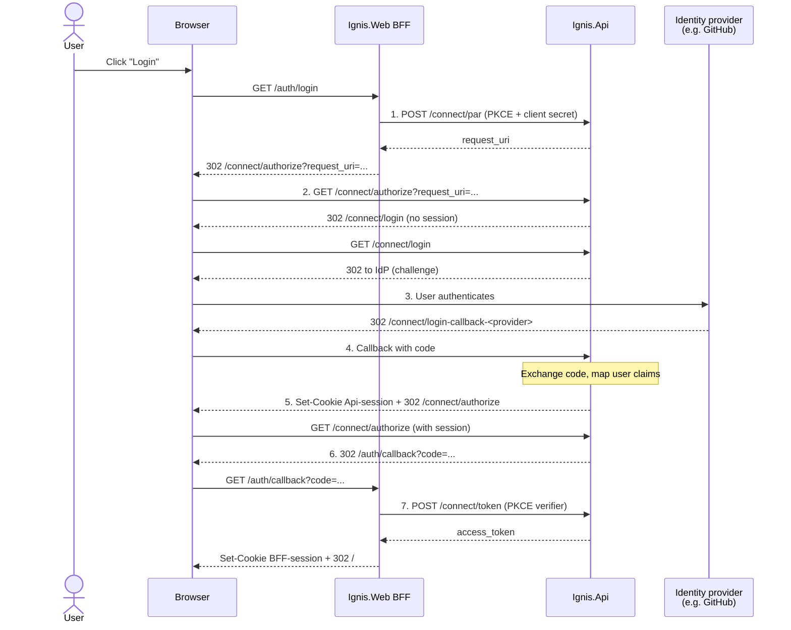

# Authentication

Ignis uses [OpenIddict](https://documentation.openiddict.com/) as its OAuth 2.0 / OIDC authorization server. User login is delegated to an external identity provider; Ignis itself does not store user credentials.

## High-level flow

1. The BFF pushes authorization parameters (client_id, redirect_uri, PKCE challenge, scope, state) to `/connect/par` over a back-channel (authenticated with the client secret) and receives a `request_uri` in return.
2. The BFF redirects the browser to `/connect/authorize?client_id=...&request_uri=...`; since no Api session cookie exists, the authorize endpoint redirects through `/connect/login`. Only the opaque `request_uri` travels through the user-agent.
3. `/connect/login` triggers an ASP.NET Core authentication challenge against the chosen external provider; the provider authenticates the user.
4. The provider redirects back to `/connect/login-callback-<provider>` with an authorization code; ASP.NET Core exchanges it and maps the provider's user info onto standard claims.
5. An Api session cookie is issued and the browser is redirected back to `/connect/authorize`.
6. The authorization endpoint now finds a valid session and returns an OAuth 2.0 authorization code by redirecting the browser to the BFF's `/auth/callback`.
7. The BFF exchanges the code for an access token at `/connect/token` over a back-channel, sending the original PKCE verifier to prove possession, and issues its own encrypted session cookie to the browser.

## Provider selection

`/connect/login` handles the configured `AuthSettings:ExternalProviders` list as follows:

- **No providers** → `503 Service Unavailable` with a problem-details body.
- **Exactly one provider** → auto-selected; the request is challenged immediately.
- **Multiple providers** → a minimal HTML page lists one link per provider; the chosen link calls back with `?provider=<name>&returnUrl=...`.

Pass `?provider=<name>` to bypass the selection page when multiple providers are configured.

## Supported providers

- [GitHub](./authenticate-with-github.md) — OAuth App with `id`, `name`, and `avatar_url` claim mapping.

OpenID Connect providers are planned but not yet supported.
